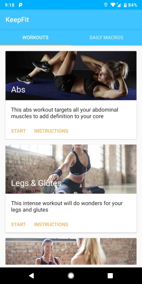
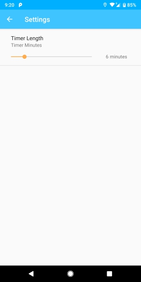

# KeepFit

Backend - written in Python using Flask and SQLite database.

The Android app is currently being rewritten using modern Android development techniques in Kotlin. The full new codebase will be reuploaded shortly.

Screenshots

 

 

 

 

